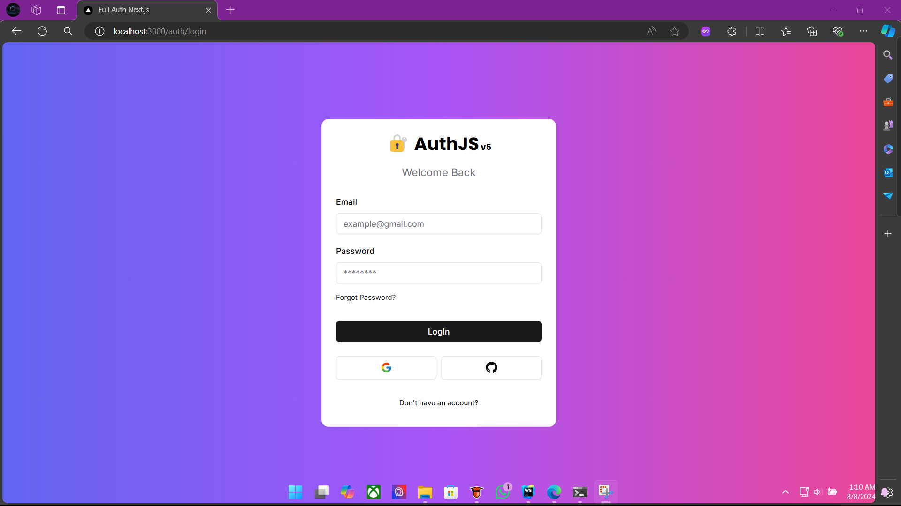
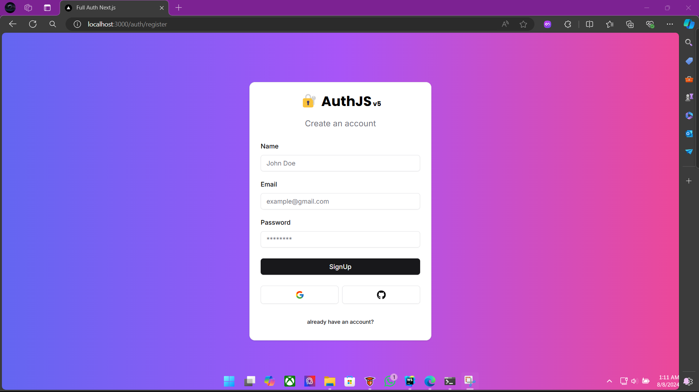
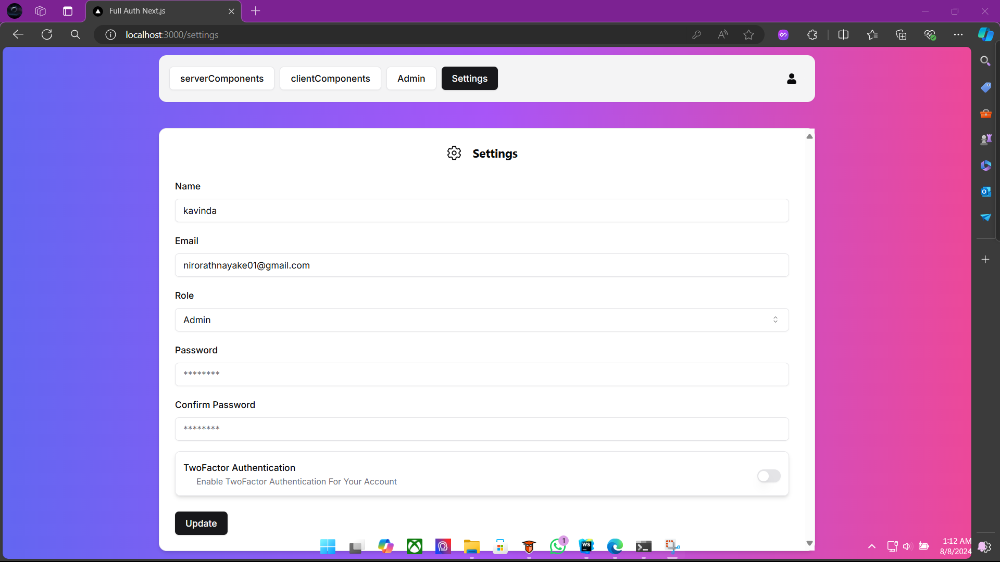
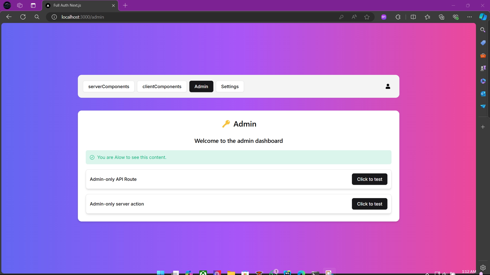
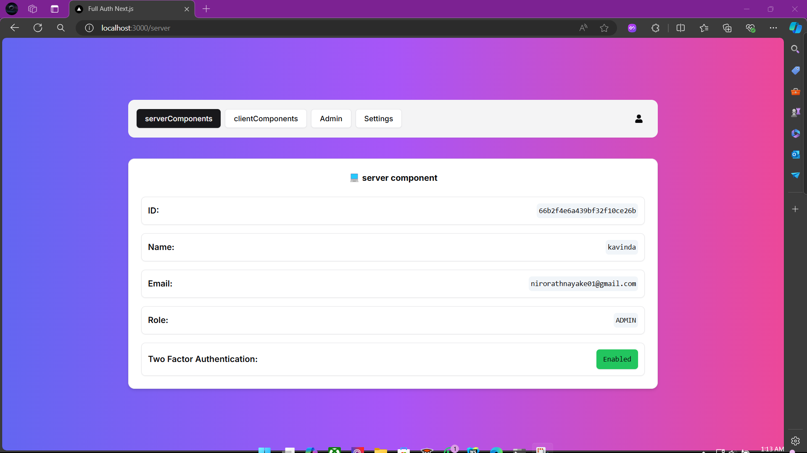

## Next.js Fullstack project with Auth.JS v5

## Features
- Authentication with Auth.JS v5
- Credential sign in
- Google sign in
- GitHub sign in
- Email verification
- 2FA
- Password reset
- Role based access control


## Used Technologies
- [Bun.sh](https://bun.sh/)
- [Next.js](https://nextjs.org/)
- [Auth.JS v5](https://authjs.dev/)
- [shadcn ui](https://ui.shadcn.com/)
- [prisma](https://www.prisma.io/)
- [MongoDB Atlas](https://www.mongodb.com/atlas)
- [Tailwind CSS](https://tailwindcss.com/)
- [React Hook Form](https://react-hook-form.com/)
- [zod](https://zod.dev/)


## Project Goals and Learning Objectives

This project is designed to deepen my understanding of modern web development using the latest features and best practices. The primary goals and learning objectives are:

* **Master Next.js 14 and Its Latest Features:** Explore and implement the latest features of Next.js 14, including the new app router and file-based routing system.


* **Implement Secure Authentication with Auth.js v5:** Learn to integrate Auth.js v5 to provide a secure login mechanism for the application. This includes understanding how to manage user sessions, handle authentication tokens, and protect user data.


* **Understand Server and Client Components:** Delve into the differences between server components and client components, and learn how to leverage their capabilities effectively within the application. This will help in optimizing the performance and user experience.


* **Protect Routes Using Middleware:** Gain proficiency in using middleware to protect routes within the application. This involves creating secure pathways that ensure only authenticated users can access certain parts of the application.


* **Implement Role-Based Access Control:** Learn to protect content based on role-based access control (RBAC). This includes setting up different user roles and permissions, and ensuring that users can only access content and features they are authorized to use.

> [!IMPORTANT]
> install the Bun CLI globally to run the project.


Windows
```bash
powershell -c "irm bun.sh/install.ps1 | iex"
```
MacOS & Linux
```bash
curl -fsSL https://bun.sh/install | bash
```
using npm
```bash
npm install -g bun
```

Create a `.env` file in the root of the project and add the following:

> [!TIP]
> `.env.sample` file is provided in the root of the project.


```bash
DATABASE_URL=
AUTH_SECRET=

AUTH_GOOGLE_ID=
AUTH_GOOGLE_SECRET=

AUTH_GITHUB_ID=
AUTH_GITHUB_SECRET=

DOMAIN_NAME="http://localhost:3000"

MY_EMAIL=
APP_PASSWORD=

DEV_MODE="development" // change to production when deploying

  ```

> [!IMPORTANT]
> The `DATABASE_URL` is the connection string to your database.
> use a cloud database like MongoDB Atlas.

Install the dependencies:

```bash
bun install
```

run the development server:

```bash
bun run dev
```
Open [http://localhost:3000](http://localhost:3000) with your browser to see the result.


## Screenshots

### LogIn Page


### Register Page


### Settings Page


### Admin Page


### client Component Page


### Server Component Page

