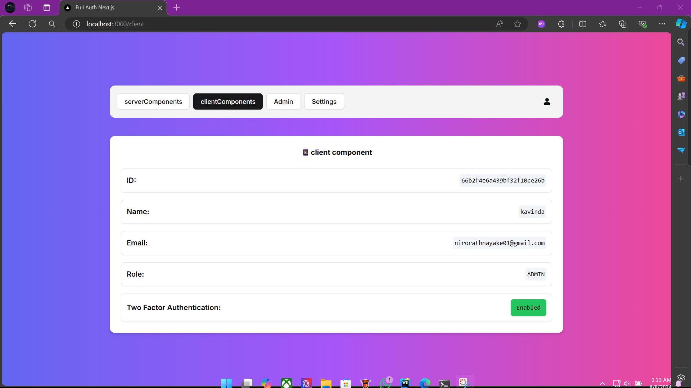

## Next.js Fullstack project with Auth.JS v5

## Features
- Authentication with Auth.JS v5
- Credential sign in
- Google sign in
- GitHub sign in
- Email verification
- 2FA
- Password reset
- Role based access control


## Used Technologies
- [Bun.sh](https://bun.sh/)
- [Next.js](https://nextjs.org/)
- [Auth.JS v5](https://authjs.dev/)
- [shadcn ui](https://ui.shadcn.com/)
- [prisma](https://www.prisma.io/)
- [MongoDB Atlas](https://www.mongodb.com/atlas)
- [Tailwind CSS](https://tailwindcss.com/)
- [React Hook Form](https://react-hook-form.com/)
- [zod](https://zod.dev/)

> [!IMPORTANT]
> install the Bun CLI globally to run the project.


Windows
```bash
powershell -c "irm bun.sh/install.ps1 | iex"
```
MacOS & Linux
```bash
curl -fsSL https://bun.sh/install | bash
```
using npm
```bash
npm install -g bun
```

Create a `.env` file in the root of the project and add the following:

> [!TIP]
> `.env.sample` file is provided in the root of the project.


```bash
DATABASE_URL=
AUTH_SECRET=

AUTH_GOOGLE_ID=
AUTH_GOOGLE_SECRET=

AUTH_GITHUB_ID=
AUTH_GITHUB_SECRET=

DOMAIN_NAME="http://localhost:3000"

MY_EMAIL=
APP_PASSWORD=

DEV_MODE="development" // change to production when deploying

  ```

> [!IMPORTANT]
> The `DATABASE_URL` is the connection string to your database.
> use a cloud database like MongoDB Atlas.

Install the dependencies:

```bash
bun install
```

run the development server:

```bash
bun run dev
```
Open [http://localhost:3000](http://localhost:3000) with your browser to see the result.


## Screenshots

### LogIn Page


### Register Page


### Settings Page


### Admin Page


### client Component Page


### Server Component Page

